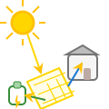

# Home Battery Optimizer

[![HACS][hacsbadge]][hacs]
[![License][license-shield]][license]



Home Battery Optimizer är en avancerad Home Assistant-integration som automatiskt optimerar laddning och urladdning av ditt hemmabatteri baserat på elpris och batteristatus. Integrationens schema och automationslogik maximerar ekonomisk nytta och självförbrukning, och ger tydlig visualisering av planerade åtgärder och batteriets status.

## Krav
- Home Assistant 2021.12.0 eller senare
- Sensorer för elpris (t.ex. Nordpool) och batteriets SoC (State of Charge)

## Funktioner
- **Automatisk laddning/urladdning**: Styrning av batteriet utifrån pris, SoC och användarinställningar.
- **Schemaläggning**: Integrationens schema hittar de bästa timmarna för laddning/urladdning.
- **Självförbrukningsautomatik**: Dynamisk logik för att maximera egenanvändning av solproduktion.
- **Konfigurerbara nummer- och switch-entiteter**: Justera minsta vinst, laddningsgrad, urladdningsgrad, laddningshastighet och urladdningshastighet direkt i Home Assistant.
- **Visualisering**: Sensorattribut och färdiga ApexCharts-exempel för tydlig översikt.
- **Tjänster**: Tvinga schemauppdatering, laddning eller urladdning via tjänster.
- **Fullt integrerad i Home Assistant**: All konfiguration via UI, stöd för HACS och anpassad ikon.

## Installation

### HACS
1. Gå till HACS → Integrations. Sök efter "Home Battery Optimizer" och installera.
2. Starta om Home Assistant.
3. Lägg till integrationen via Home Assistant UI ("Lägg till integration" → "Home Battery Optimizer").
4. Välj din elpris- och SoC-entity.

### Manuell installation
1. Kopiera mappen `custom_components/home_battery_optimizer` till din Home Assistant `custom_components`-katalog.
2. Starta om Home Assistant.
3. Lägg till integrationen via Home Assistant UI.

## Konfiguration
All konfiguration sker via Home Assistant UI. Efter installationen väljer du:
- **Elpris-entity** (t.ex. Nordpool)
- **Batteri SoC-entity**
- **Max SoC-entity** (valfri, om du har en separat sensor för max laddnivå)
- **Solproduktion-entity** (valfri, för självförbrukningsautomatik)
- **Förbruknings-entity** (valfri, för självförbrukningsautomatik)

Justera sedan:
- **Minimum Profit**: Minsta vinst för att ladda/urladdda
- **Charge/Discharge Percentage**: Hur mycket batteriet ska laddas/urladdas
- **Charge/Discharge Rate**: Hastighet för laddning/urladdning

Du kan även använda tjänster för att tvinga schemauppdatering, laddning eller urladdning.

> **Tips:** Alla entiteter kan ändras i efterhand via integrationens konfigurationssida i Home Assistant.

## Entiteter
| Entity | Typ | Beskrivning |
|--------|-----|-------------|
| `sensor.battery_schedule` | Sensor | Schema och status för batteriet (inkl. pris, SoC, planerade åtgärder) |
| `switch.battery_charge` | Switch | Aktiverar/inaktiverar laddning |
| `switch.battery_discharge` | Switch | Aktiverar/inaktiverar urladdning |
| `number.battery_minimum_profit` | Number | Minsta vinst för att ladda/urladda |
| `number.battery_charge_percentage` | Number | Laddningsgrad |
| `number.battery_discharge_percentage` | Number | Urladdningsgrad |
| `number.battery_charge_rate` | Number | Laddningshastighet |
| `number.battery_discharge_rate` | Number | Urladdningshastighet |

## Sensorattribut
`sensor.battery_schedule` har bl.a. följande attribut:
- `data`: Array med schema (start, end, action, price, soc, charge, discharge)
- `current_soc`: Aktuell SoC
- `estimated_soc`: Beräknad SoC per timme
- `window`: Nuvarande åtgärdsfönster

## Visualisering i Lovelace (ApexCharts)

### Exempel: ApexCharts Card

Kopiera YAML-koden nedan till ett "Manual card" i Home Assistant för att visualisera schema, pris, laddning/urladdning och SoC:

```yaml
type: custom:apexcharts-card
now:
  show: true
  label: Now
  color: "#ffc0cb"
locale: en
header:
  show: true
  title: Battery Optimizer
graph_span: 2d
span:
  start: day
yaxis:
  - id: price
    apex_config:
      forceNiceScale: true
  - id: action
    min: -1
    max: 1
    show: false
  - id: soc
    min: 0
    max: 100
    opposite: true
    decimals: 0
    show: true
apex_config:
  legend:
    show: true
    showForSingleSeries: true
    showForNullSeries: true
  xaxis:
    labels:
      show: true
      format: HH
      rotate: -45
      rotateAlways: true
      hideOverlappingLabels: true
      style:
        fontSize: 10
        fontWeight: 400
series:
  - entity: sensor.battery_schedule
    name: Electricity price
    unit: " öre/kWh"
    yaxis_id: price
    data_generator: |
      return entity.attributes.data
        ? entity.attributes.data.map(entry => [new Date(entry.start), entry.price])
        : [];
    type: line
    float_precision: 0
    color: "#2196f3"
    show:
      in_header: false
      legend_value: false
    extend_to: false
    color_threshold:
      - value: -100
        color: cyan
      - value: 0
        color: green
      - value: 40
        color: orange
      - value: 100
        color: red
      - value: 200
        color: magenta
      - value: 500
        color: black
  - entity: sensor.battery_schedule
    name: Charge
    yaxis_id: action
    data_generator: |
      return entity.attributes.data
        ? entity.attributes.data.map(entry => [new Date(entry.start), entry.charge === 1 ? 1 : 0])
        : [];
    type: area
    curve: stepline
    color: "#4caf50"
    opacity: 0.5
    show:
      in_header: false
      legend_value: false
    extend_to: false
  - entity: sensor.battery_schedule
    name: Discharge
    yaxis_id: action
    data_generator: |
      return entity.attributes.data
        ? entity.attributes.data.map(entry => [new Date(entry.start), entry.discharge === 1 ? -1 : 0])
        : [];
    type: area
    curve: stepline
    color: "#f44336"
    opacity: 0.5
    show:
      in_header: false
      legend_value: false
    extend_to: false
  - entity: sensor.battery_schedule
    name: Estimated SoC
    yaxis_id: soc
    data_generator: |
      return entity.attributes.data
        ? entity.attributes.data.map(entry => [new Date(entry.start), entry.soc])
        : [];
    type: line
    color: "#ffd600"
    stroke_width: 2
    show:
      in_header: false
      legend_value: false
    extend_to: false
experimental:
  color_threshold: true
```

Justera entity-namn vid behov.

## Felsökning
- Kontrollera att rätt entities är valda vid installation.
- Om schemat inte uppdateras, kontrollera att SoC-entity rapporterar korrekt värde.
- Vid problem, starta om Home Assistant och kontrollera loggarna.

## Bidra
Bidrag är välkomna! Öppna gärna ett issue eller en pull request på GitHub.

## Licens
MIT License. Se LICENSE-filen för detaljer.

[hacs]: https://github.com/hacs/integration
[hacsbadge]: https://img.shields.io/badge/HACS-Default-41BDF5.svg?style=for-the-badge
[license-shield]: https://img.shields.io/github/license/farmed-switch/home-battery-optimizer?style=for-the-badge
[license]: https://github.com/farmed-switch/home-battery-optimizer/blob/main/LICENSE